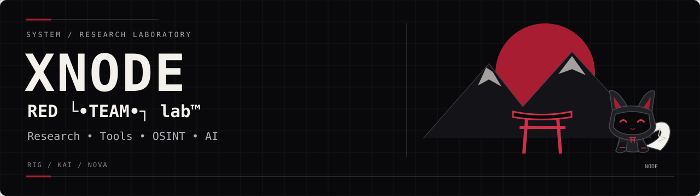
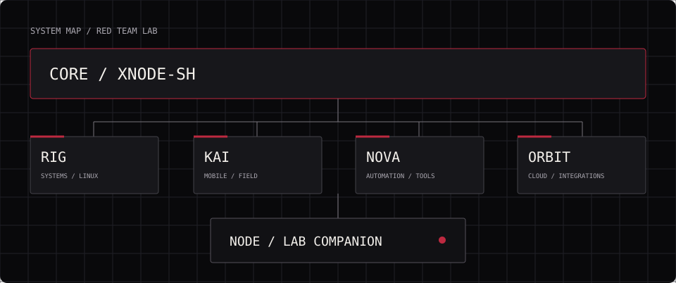
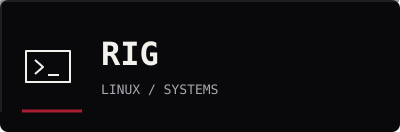
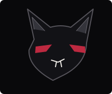
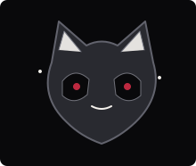
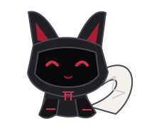

  

  
  
  

<a href="https://github.com/Xnode-sh/RED-TEAM-LAB">Штаб</a> · <a href="https://github.com/Xnode-sh/xnode-osint">OSINT</a> · <a href="https://github.com/Xnode-sh/termux-agent">AI</a> · <a href="https://redteam.is-a.dev">Сайт</a>

**RED └•TEAM•┐ lab™** — инженерная лаборатория XNODE. Исследуем Linux, мобильные системы и облачные среды; создаём инструменты, автоматизацию и AI-интеграции. Штаб и инженерный процесс — в [RED-TEAM-LAB](https://github.com/Xnode-sh/RED-TEAM-LAB).

## Архитектура CORE

**CORE → RIG · KAI · NOVA · ORBIT** 
**LAB COMPANION → NODE**

## Engineering Nodes

| **RIG · Systems & Linux** | **KAI · Mobile Field** |
| :---: | :---: |
|  |  |
| **Северный волк** · Linux, оборудование, сеть и надёжность инфраструктуры. | **Красная панда** · Android, Termux и мобильная полевая работа. |

| **NOVA · Mobile Automation & Tooling** | **ORBIT · Cloud Workspace & Integration** |
| :---: | :---: |
|  |  |
| **Чёрная лиса** · CLI, автоматизация, инструменты и интеграции. | **Полярная сова** · Codex Cloud, рабочие пространства и координация интеграций. |

## NODE · Lab Companion

**NODE** — кибер-лисёнок с чёрным корпусом, белым хвостом и красным сигналом. Он сопровождает Engineering Nodes как маскот и не входит в инженерную команду.

 

## Проекты лаборатории

| Слой | Проекты |
| :--- | :--- |
| **CORE** | [RED-TEAM-LAB](https://github.com/Xnode-sh/RED-TEAM-LAB) — штаб, роли и workflow |
| **LAB** | [termux-agent](https://github.com/Xnode-sh/termux-agent) — локальный LLM · [vibe-chat](https://github.com/Xnode-sh/vibe-chat) — AI CLI |
| **TOOLS** | [xnode-osint](https://github.com/Xnode-sh/xnode-osint) · [sockpuppet-hunter](https://github.com/Xnode-sh/sockpuppet-hunter) · [wifi-audit](https://github.com/Xnode-sh/wifi-audit) · [netmon](https://github.com/Xnode-sh/netmon) |
| **PUBLIC** | [Сайт лаборатории](https://redteam.is-a.dev) · профиль XNODE |

## Технологии

**Системы** 

**Разработка** 

**Облако и инструменты** 

## Статистика

  
  

  

## Workflow

PLAN → ISSUE → BRANCH → WORK → TEST → PR → REVIEW → MERGE

Рабочие ветки: rig/task · kai/task · nova/task · orbit/task. Подробнее: [WORKFLOW.md](https://github.com/Xnode-sh/RED-TEAM-LAB/blob/main/WORKFLOW.md).

## Активность

## Статус лаборатории

 CORE объединяет четыре инженерных узла. Проекты развиваются, изменения проходят review. Статусы проектов указаны в их README.

  
  
  
  
  

